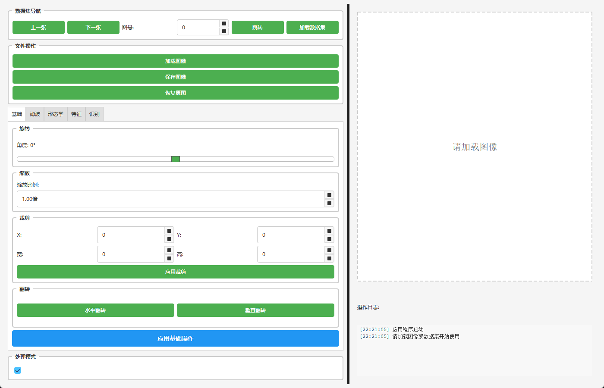

# 图像处理与识别软件 (Image Processing & Recognition GUI)

**注意**: 本项目只是一个课程作业，仅供参考。

一个基于PyQt6的图像处理与手写数字识别软件，支持多种图像处理算法和两种识别模型。

## 项目概述

本项目实现了一个功能完整的图像处理与识别软件，包括：

- **图像处理功能**：旋转、缩放、裁剪、滤波、形态学操作、边缘检测等
- **手写数字识别**：支持MobileNetV2深度学习模型和SVM+HOG传统机器学习模型
- **用户友好界面**：基于PyQt6的现代化GUI界面
- **模块化设计**：清晰的代码结构，易于维护和扩展



## 项目结构

```
project_root/
├── data/                   # 存放数据集 (如 MNIST)
├── models/                 # 存放训练好的模型文件 (.pth / .pkl)
├── src/
│   ├── ui/                 # 界面相关代码
│   │   ├── main_window.py  # 主窗口实现
│   │   └── __init__.py
│   ├── core/               # 图像处理核心逻辑
│   │   ├── basic_ops.py    # 基础操作 (旋转、缩放、裁剪)
│   │   ├── filters.py      # 滤波操作
│   │   ├── morphology.py   # 形态学操作
│   │   ├── features.py    # 特征提取 (边缘检测、直方图)
│   │   └── __init__.py
│   ├── ml/                 # 机器学习/深度学习相关
│   │   ├── models.py       # 模型定义 (MobileNetV2)
│   │   ├── dataset.py      # 数据集管理
│   │   ├── train_mobilenet.py  # MobileNetV2训练脚本
│   │   ├── traditional_ml.py   # SVM+HOG模型
│   │   ├── predict.py     # 统一预测接口
│   │   └── __init__.py
│   └── utils/              # 工具函数
│       ├── image_utils.py  # 图像工具函数
│       └── __init__.py
├── main.py                 # 程序入口
├── requirements.txt        # 依赖列表
└── README.md             # 项目说明
```

## 技术栈

- **GUI框架**: PyQt6 6.6.1
- **图像处理**: OpenCV 4.8.1.78
- **数值计算**: NumPy 1.26.4
- **深度学习**: PyTorch (torch124环境)
- **传统机器学习**: Scikit-learn 1.6.1
- **特征提取**: Scikit-image 0.25.2
- **数据可视化**: Matplotlib 3.10.1

## 功能特性

### 图像处理功能

#### 基础操作
- 图像旋转 (-180° 到 +180°)
- 图像缩放 (0.1倍 到 5.0倍)
- 图像裁剪 (指定区域)
- 图像翻转 (水平/垂直)

#### 滤波功能
- 高斯滤波
- 均值滤波
- 中值滤波
- 双边滤波
- 锐化滤波
- 浮雕滤波
- 运动模糊

#### 形态学操作
- 膨胀
- 腐蚀
- 开运算
- 闭运算
- 形态学梯度
- 顶帽变换
- 黑帽变换

#### 特征提取
- Canny边缘检测
- Sobel边缘检测
- 拉普拉斯边缘检测
- 灰度直方图
- 彩色直方图
- 直方图均衡化
- 自适应直方图均衡化

### 识别功能

#### MobileNetV2模型
- 手动实现的MobileNetV2网络结构
- 适配MNIST数据集 (单通道输入，10类输出)
- 支持不同输入尺寸

#### SVM+HOG模型
- 使用HOG特征提取
- SVM分类器
- 快速训练和预测

#### 集成预测
- 结合两个模型的结果
- 基于置信度的加权平均
- 自动选择最佳预测结果

## 环境要求

- Python 3.9+
- Conda环境 (推荐使用torch124)
- 详见 `requirements.txt`

## 安装与使用

### 1. 环境准备

```bash
# 激活torch124环境
conda activate torch124

# 安装额外依赖 (如果需要)
pip install -r requirements.txt
```

### 2. 数据集准备

首次运行时会自动下载MNIST数据集到 `./data` 目录。

### 3. 模型训练

#### 训练MobileNetV2
```bash
python src/ml/train_mobilenet.py
```

#### 训练SVM+HOG
```bash
python src/ml/traditional_ml.py
```

### 4. 运行应用程序

```bash
python main.py
```

## 使用说明

### 基本操作流程

1. **加载数据集**: 点击"加载数据集"按钮加载MNIST数据
2. **导航图像**: 使用"上一张"/"下一张"按钮或输入图号跳转
3. **选择功能**: 在左侧选项卡中选择需要的处理功能
4. **调整参数**: 设置相应的处理参数
5. **应用处理**: 点击"应用"按钮执行处理
6. **查看结果**: 在中央区域查看处理后的图像
7. **保存结果**: 点击"保存图像"保存处理结果

### 识别功能

1. **加载模型**: 在识别选项卡中点击"加载模型"
2. **选择模型**: 选择MobileNetV2、SVM+HOG或集成预测
3. **开始识别**: 点击"开始识别"按钮
4. **查看结果**: 在识别结果区域查看预测类别和置信度

## 许可证

本项目采用MIT许可证，详见LICENSE文件。
